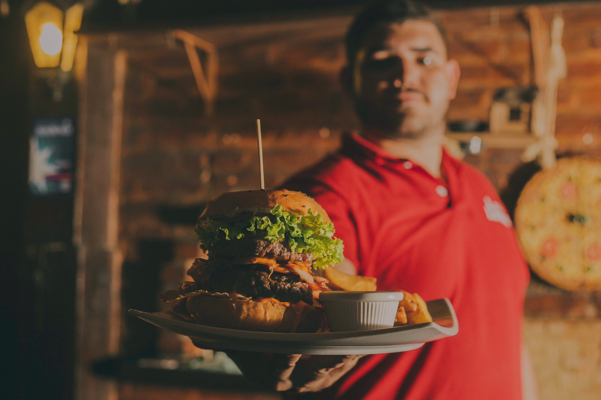

Welcome to Delicious Bites – your gateway to a world of culinary excellence delivered straight to your doorstep. Our tastefully curated menu offers a diverse range of mouthwatering dishes crafted with fresh and quality ingredients. From quick and reliable delivery services to a user-friendly ordering system, we strive to make your dining experience seamless and enjoyable. Explore our exciting weekly specials and take advantage of customizable orders tailored to your preferences. Immerse yourself in a culinary journey that combines convenience with gastronomic delight. Join us on this epicurean adventure, and be the first to experience the delectable offerings of Delicious Bites. Subscribe now for updates and exclusive launch offers, as we eagerly anticipate the pleasure of serving you the finest in gastronomy.

The development of the Delicious Bites website was a meticulous process aimed at creating a visually appealing and user-friendly platform. The design focuses on providing a seamless experience for visitors, incorporating a responsive layout that adapts to various devices. Leveraging HTML and CSS, the webpage features two distinct columns, each with its own image slot for enhanced visual appeal. The use of flexbox and grid layout ensures a well-organized structure, while carefully chosen colors and typography contribute to a polished and inviting aesthetic. The integration of dynamic content, such as background images and a subscription form, enhances user engagement. The development process prioritized not only aesthetics but also functionality, with attention to accessibility and a smooth ordering experience. This webpage reflects our commitment to delivering not just delicious bites but also an immersive and delightful online presence for our users.

<!DOCTYPE html>
<html lang="en">

<head>
    <meta charset="UTF-8">
    <meta name="viewport" content="width=device-width, initial-scale=1.0">
    <title>Delicious Bites - Coming Soon</title>

    

</head>

<body>

    

        

            

                <h1>Delicious Bites</h1>
                <h3 class="salutation">Serving Culinary Delights to Your Doorstep</h3>
                <h4>Order Your Favorite Dishes with Ease</h4>

                

                    <h4>Key Features:</h4>
                    <ul>
                        <li> Diverse Menu Options</li>
                        <li> Quick and Reliable Delivery</li>
                        <li> Fresh and Quality Ingredients</li>
                        <li> User-Friendly Ordering System</li>
                    </ul>
                

                <a href="#" class="cta-button">Order Now</a>

            

            

                

            

        

        

            <h3>Subscribe for Updates</h3>
            
Be the first to know about our launch and special offers.

            <input type="email" placeholder="Your Email Address">
            <button>Subscribe</button>
        

    

</body>

</html>
